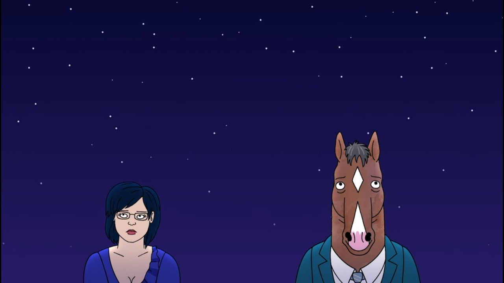
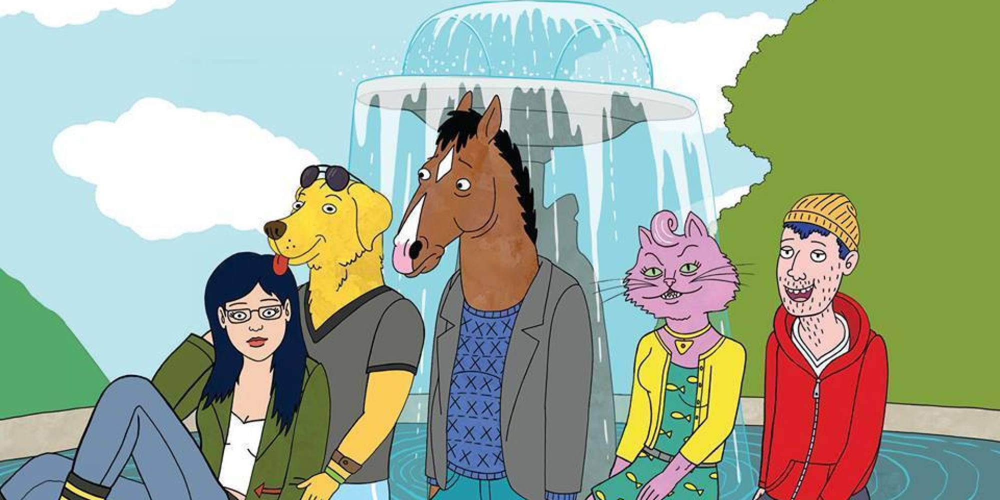

BoJack Horseman is a character you can laugh with, cry, hate and love all at the same time. This show tackles so many challenging issues with the human condition including what it means to have a family, what it means to love someone, fleeting happiness, drug abuse, nihilism, child abuse, death, depression, legacy and so much more.

The creators of the show clearly have a love for their characters and the writer Raphael Bob-Waksberg doesn't hold back on delivering them amazing lines and character arcs. I was consistently interested in all of the side character's lives because they felt real. Even in Season 4 Episode 2 with Eddie the dragonfly. I so desperately wanted both of these characters to open up to each other with what they are both going through. It was sad to see BoJack leave Eddie never to return.

Life is cruel and doesn't always work out the way we want it to. That's primarily what the whole show is about. It's a take on trying to be happy and never quite getting enough of what you need to be that. BoJack drowns himself in liquor, drugs, sex and even in part destroying other people with his self-destructive tendencies to distract himself from not being happy. We saw that with Wanda, and well, most of his relationships.

We see a similar trend with all of the characters in the show of success and failure and never being quite satisfied with either. It was only until they began to accept themselves and take resposibility for their actions that they truly started to come to terms with their meaningless lives.

There is something here for everyone. While I think everyone can relate to BoJack in a way, there are also a lot of things going on with other characters that make us question our own circumstances and decision making. I never wanted this show to end - I watched the whole thing in under a week. It was like looking into a mirror with all of my thoughts, questions, desires and having them blasted back at me with no remorse and little to no closure - not to mention an emotional rollercoaster. I cried once every night of that week without fail. I fell in love with all of these characters and just wanted them to find peace with themselves.

I think Diane puts the ending of the show perfectly in perspective:

> "There are people that help you become the person you end up being, and you can be grateful for them, even if they were never meant to be in your life forever."

Her quote doesn't just apply to her relationship with BoJack, but also our relationship with him too. The lessons and stories of this show have left a mark on me that will stick with me forever. Even though these are just animated anthropomorphic animal characters in a loosely realistic world, it doesn't change what the creators of this show wanted to get across. These situations are very real, and we see ourselves in them at every turn.

This show has given me a lot to think about.

Goodbye BoJack Horseman, this is where our lives stop intersecting and I move into the next chapter of my life. The impact of your life will stick with me and motivate me to be a better person. I'm glad to have met you, I'm sad it's over, but it was nice while it lasted. 

I hope you are able to be happy.

