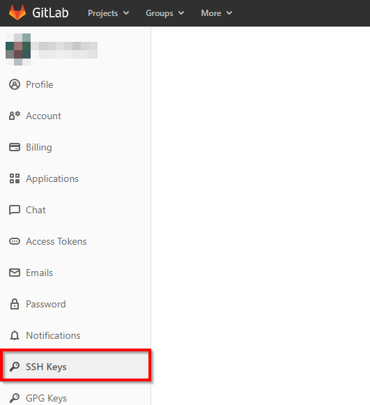
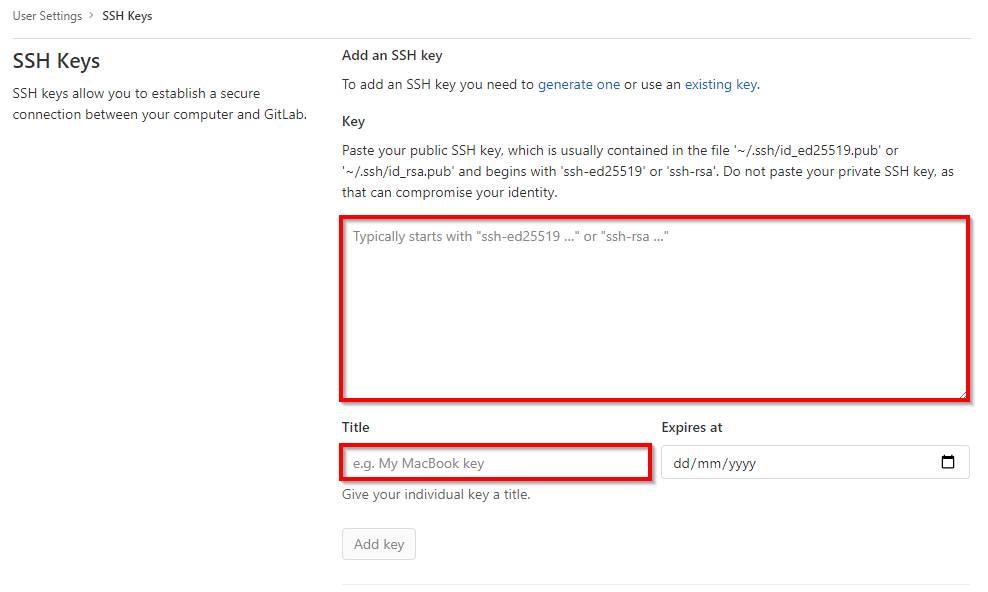

```toc

```

### Prerequisites:

To follow along with this guide, you'll need:

- A GitLab Account
- A Remote Development Server (to make your own, check out our
  [article](/setup-remote-development-server/))

### Configure GitLab SSH Key

On your Remote Development Server, navigate to /home/<username>/.ssh
and create a directory for GitLab:

```bash
mkdir gitlab
```

Change into the directory we created:

```bash
cd gitlab
```

Now it's time for us to generate a new SSH Key:

```bash
ssh-keygen -f /home/<username>/.ssh/gitlab/id_rsa
```

There is no requirement to enter a password for the SSH Key. Enter
down twice to skip the password creation prompt.

After the key has been generated, open the file id_rsa.pub file and
copy the key.

```bash
nano id_rsa.pub
```

Navigate to your GitLab Account Settings. Select SSH Keys from the
menu on the left hand side.



Enter the contents of the key in the relevant field and give the SSH
Key a name.



There is no requirement to set an expiry date on the SSH Key. Feel
free to leave it blank when adding the key. Setting an expiry date can
be useful if you are sharing SSH Keys with colleagues or are
consistently swapping between devices that are also used by others.

Add the key and test that you are able to clone one of your
repositories. If you are able to successfully clone your repository,
you have correctly setup the SSH Key.

### Conclusion

If you have any questions or think I could have taken a better
approach, let me know! Feel free to reach out in the comments below or
reach out to me via [email](mailto:zacchary@puckeridge.me).
