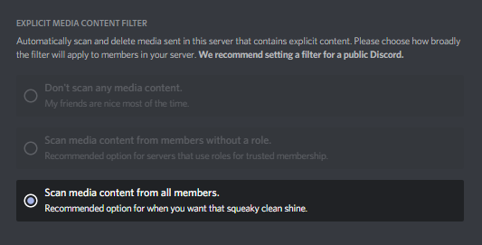

```toc

```

This article goes over some easy to implement tips to make your Discord Server for more secure and safe from trolls and raids.

### Secure your Discord Account

The most important part about owning and running your own Discord Server is making sure that your Discord Account is secure. Without a secure account, you are running the risk of losing your Discord Server to a bad actor. Always use a secure password and [enable Two Factor Authentication](https://support.discord.com/hc/en-us/articles/219576828-Setting-up-Two-Factor-Authentication). It's a quick and simply way to add an extra layer of security to your Discord Account.

### Secure your Discord Server

Every Discord Server should [Higest Verification Level](https://support.discord.com/hc/en-us/articles/216679607-What-are-Verification-levels-) to prevent automated bots and trolls from ruining the experience for your members. On top of this, it's highly recommend that all content sent by your members is scanned by Discord's content automation system to prevent explicit content.



Forcing a Two Factor Authentication Requirement for Moderators is also highly recommended. This ensures that all of your Moderators are using the highest level of security on their account.

Another pro-tip is to keep an eye on the invite codes to your Discord server and make sure they aren't being used for any nefarious schemes, like raids.

### Moderation Bots

There are a huge number of Discord Bots that fulfill the moderation role quite well. But something that I've really enjoyed using is [carl.gg](https://carl.gg). It is by far, the easiest bot to setup and use to moderate your Discord server. From logging, to mass deletion, auto mute and auto language moderation the bot is powerful enough for even the largest of communites. It's documentation is also incredibly easy to follow.

### Lock new users to an 'Unverified Role'

Using carl.gg, I automatically assign new users to the 'Unverified Role'. This locks users to the #welcome and #rules channel until a moderator comes to 'Verify' them. Once the user has been verified, we assign them a new role, "New Member". This prevents them from posting images, which is hugely important to locking down bad acting users.

### Don't ban trolls

Now, this tip might sound counter-intuitive, but in practice, it works perfectly. Instead of banning trolls, simply remove their roles and assign them a role which restricts them to a channel which only themselves, other trolls and the moderators are apart of.

Now, instead of annoying the rest of your community, you can poke fun at them and waste their time, and when you get bored, simply mute the channel. I have enjoyed many a time trolling the trolls - so I figured I'd share that handy tip with you all.

### Conclusion

Overall, it's relatively easy to secure your Discord server, but the above tips may not be something you think about straight away. These tips have only come about through trial and error and what's worked for our community, so I highly recommend that you experiment with your own community to come up with something that works for you.

Running your own Discord Community is incredibly fun and rewarding to watch grow, cultivate and mature.

If you have any questions or think I could have taken a better approach, let me know! Feel free to reach out in the comments below or reach out to me via [email](mailto:zacchary@puckeridge.me).
