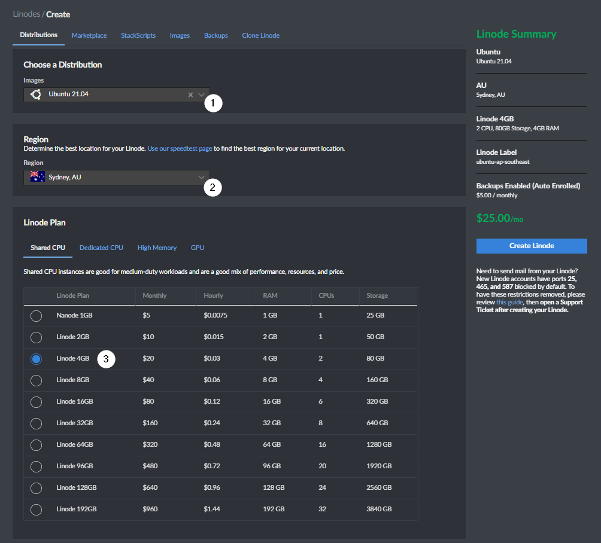
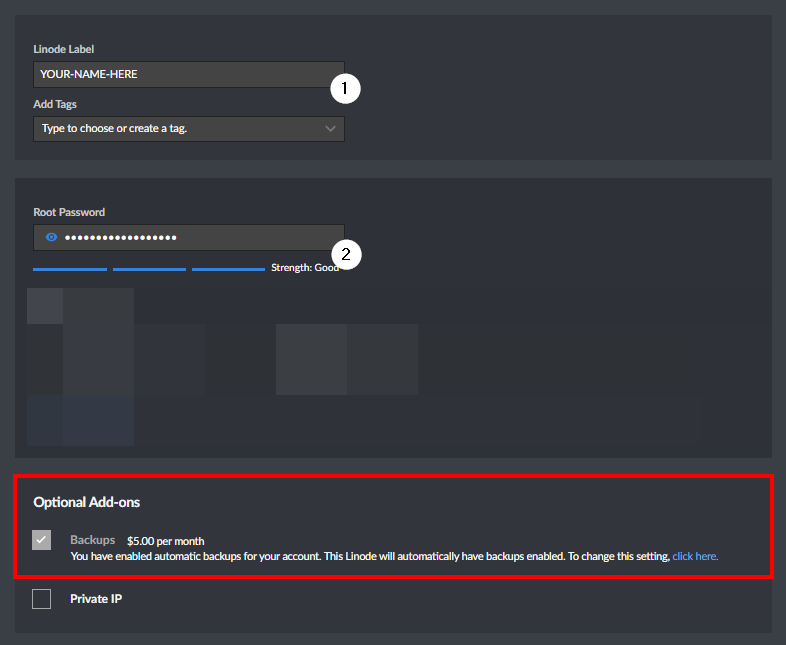
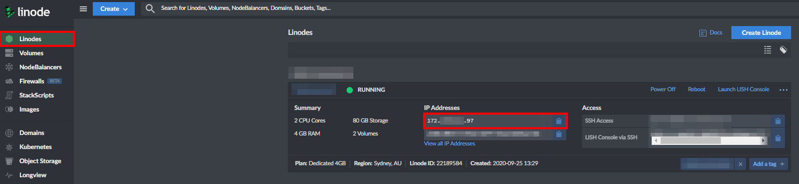
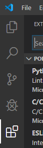
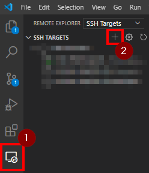
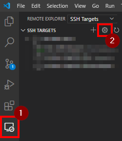
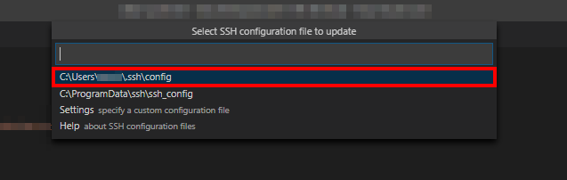
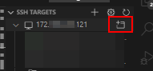

```toc

```

### What even is a Remote Development Server?

A Remote Development Server, as the name implies, is a server hosted
remotely (typically on a Virtual Machine) which it's sole purpose is
to host your code and active repositories. It's great for storing work
in progress projects and allows you to pick up and go from exactly
where you left off.

### What are the advantages of a Remote Development Server?

There are both pros and cons for using a Remote Development Server.
These include:

**Some Pros:**

1. **Develop on the Operating System your code will be hosted on:**
   One of the biggest advantages of a Remote Development Server is the
   ability to develop using the same OS your production servers are
   using without having to use that OS on your own PC. This allows you
   to do a huge variety of extended testing and real world scenarios.
2. **Run Time Consuming Tasks in the background:** If you are a data
   scientist or machine learning developer, you will find that most
   modern hardware solutions will significantly slow down you computer
   or laptop when running simulations. Utilising a Remote Development
   Server allows you to offload this work.
3. **Better Hardware:** By having a Remote Development Server, you are
   in fact creating the ability for yourself to be able to code from
   any type of hardware or device as all the computing is completed
   remotely.

plus many more features.

**Some Cons:**

1. **Remote Development Servers require an Internet Connection:** The
   only major disadvantage when it comes to Remote Development Servers
   is that they require an internet connection to prevent your work
   from being interrupted. In future however, I will be providing an
   article that completely eliminates these cons by combining the
   local and remote development process.

As you can see, the pros definitely outweigh the cons in this
scenario.

<blockquote id="blockquote-info">
Note: This is not an exhaustive list or pros and cons, but some of the more important reasons to utilise a Remote Development Server.
</blockquote>

### Prerequisites:

In order to follow along with this guide, you'll need:

- A local development machine running Windows, Mac OS X or Linux.
- Visual Studio Code, which can be downloaded and installed from the
  official website.
- A Linode Account.

### Step 1 - Deploying a Linode Instance

To get started, we first need to deploy our Linode Server. To ensure
that we have plenty of headroom to run our applications, we will be
deploying a Shared 4GB Linode Instance with Ubuntu as our distribution
of choice.



Simply select the latest Ubuntu Distribution from the drop down menu,
select a region and the select the Linode 4GB Plan.

Next, we need to give our Linode Instance a name and password. Once
this has been filled out, we are ready to create our Linode Instance!



<blockquote id="blockquote-info">
Note: I recommend that you pay for automated backups of your Linode Instance in the case that you need to rollback any changes to your server.

It can take anywhere from 5-10 minutes for the server to deploy.

</blockquote>

### Step 2 - Logging into your Linode Instance

Once your server has deployed successfully, we need to remotely log in
to the server using the SSH protocol. To do this, open a Windows
Command Prompt and type the following:

```bash
ssh root@your-servers-ip-address
```

You can find your servers IP address on Linode's Overview page as
demonstrated below:



### Step 3 - Updating Ubuntu and Creating a User

Once we have successfully logged in, we need to ensure that our Ubuntu
Server is updated with the latest packages. To ensure our server is up
to date, run the following command:

```bash
sudo apt update && sudo apt upgrade -y
```

Once our server is up to date, it is time to create a new user:

```bash
adduser example
```

It's strongly recommended to create a new user as running your server
from the root user makes the server more vulnerable to security
breaches. Creating a new user allows us to lock down the server and
improve its security.

You will be asked to create an account password and fill out some
additional information. The additional information is not required and
you may leave the fields blank if you wish.

Please see my article for
[tips on securing an Ubuntu Server.](/tips-secure-ubuntu-server/)

### Step 4 - Granting Superuser Privileges

We have successfully configured a new user. However, this new user
does not have any superuser privileges. To avoid having to log out and
log in every time we need to run a command with higher elevation, we
can grant superuser privileges to our new user.

To add these privileges, run the following command as the root user:

```bash
usermod -aG sudo example
```

Now, the new user can run commands with superuser privileges by typing
sudo before commands.

### Step 5 - Creating an SSH Key

Setting up an SSH Key with your server will make your life easier by
not having to enter a username and password every single time you
connect to the server.

Open a Command Prompt Terminal and type the following command to
create a key pair on your local computer.

```bash
ssh-keygen
```

After executing the command, you should receive the following output:

```bash
Generating public/private rsa key pair.
Enter file in which to save the key (/your_home/.ssh/id_rsa):
```

Press enter to save the key pair into the .ssh/ subdirectory. If you
are asked to overwrite an existing key pair you may want to press
ctrl+c and cancel if you had previously generated an SSH key pair.

You will then be prompted to enter a passphrase. This is an optionally
step and requires additional configuration to setup with Visual Studio
Code. If you are happy to proceed without a passphrase, simply hit
enter. The SSH key pair has now been successfully generated.

Run the following command to copy your key pair to your Linode
Instance:

```bash
cat ~/.ssh/id_rsa.pub | ssh example@your-server-ip "cat >> ~/.ssh/authorized_keys"
```

Replace example with your user and the IP for your Linode Instance.
You have now successfully copied your SSH key pair to your server!

### Step 6 - Configure SSH Key with Visual Studio Code

This step covers the process of adding the SSH Key Configuration File
to Visual Studio Code. You’ll need the following pieces of
information:

- The server’s IP or hostname.
- The username you’ll connect with.
- The private key that we generated above.

On the left-hand side of the IDE there is a vertical row of five
icons. Select the bottom icon as shown below:

Search for the Extension Remote Explorer and install the extension.



Once the extension has been installed, select it on the left hand
sidebar and select the Plus Icon as shown below:



Enter your SSH details for the Ubuntu Server.

```bash
ssh username@hostname
```

You may be prompted to choose the hosts operating system. Select
Linux.

Then go back to the extension and select the configure icon as shown
below:



Select the following result:



Add the following lines to the config file:

```bash
PreferredAuthentications publickey
IdentityFile %d\.ssh\id_rsa
```

The config file should now look like the following:

```bash
Host my_remote_server
    HostName your_server_ip
    User example
    PreferredAuthentications publickey
    IdentityFile %d\.ssh\id_rsa
```

Here’s how this configuration file works:

- Host: This is where you can specify a nickname for your host. You
  can use this nickname instead of the full IP address or host name
  when connecting to the server.
- HostName: The actual hostname of the server, which is either an IP
  address or a fully qualified domain name.
- User: The user you want to use to connect to the server with.
- IdentityFile: The path to your SSH private key. On Mac and Linux
  systems, you’ll find this in your home directory in a hidden .ssh
  directory, typically called id_rsa.

Make sure your IdentityFile is linked to the id_rsa private key that
was locally generated on your machine.

Save the config file and connect to SSH Target by selecting as
demonstrated:



You have successfully connected your Visual Studio Code to your Linode
Instance.

### Conclusion

If you have any questions or think I could have taken a better
approach, let me know! Feel free to reach out in the comments below or
reach out to me via [email](mailto:zacchary@puckeridge.me).
