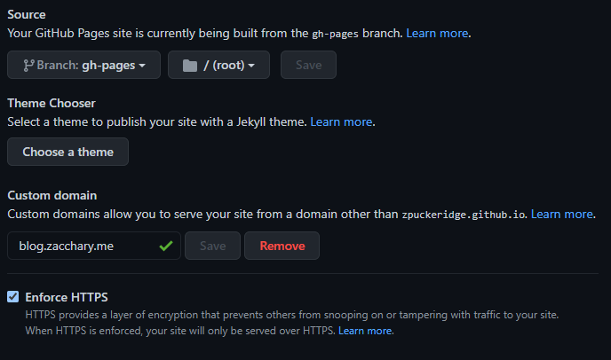

The following article will go through the process of using Gatsby and React to build a simple and minimalistic blog which will be hosted using GitHub Pages.

---

### Disclaimer:
The following article assumes that you some general knowledge in the following areas:
- Git
- Linux Terminal

---

### What is Gatsby?
Gatsby is an open source frontend framework commonly used in the development of fast websites and websites. It generates static websites, similar to Next.js and Jekyll. 

Why should we use it? Well, simply put - the plugin ecosystem put together by the Gatsby community. The plugins can be utilised with Gatsby to create ecommerce platforms, wikis and in our case, a blog.

### What is GitHub Pages?
GitHub Pages allows you to host websites and projects directly from your GitHub Repository. It's super handy!

### Setting up Gatsby
First of all, we need to ensure we are using the latest version of Node. To check we are using the latest version, run the following:

`node-v`

Gatsby aims to support all versions of Node that haven't yet reached their End of Life Status. However, it's ideal that we use the latest version of Node.

Now, it's time to install the Gatsby CLI package to our machine so that we can run Gatsby related commands.

```
yarn add gatsby-cli
```

or if you are using Node Package Manager:

    npm install -g gatsby-cli

### Creating the Project
Now that we have installed the gatsby-cli, we can create a new Gatsby project using the community built [gatsby-starter-blog](https://github.com/gatsbyjs/gatsby-starter-blog).

    gatsby new my-blog https://github.com/gatsbyjs/gatsby-starter-blog

This will create a new directory called "my-blog" with the contents of the gatsby-starter-blog repository. It will automatically install the required dependencies.

Once the installation is complete, `cd` into the new directory and run the following:

    yarn develop

or if you are using Node Package Manager:

    npm run develop

or if you prefer to use Gatsby directly:

    gatsby develop

Using `yarn` or `npm` is preferred because this uses the locally installed version of Gatsby for your project instead of the global installation.

> Note: This helps us avoid issues with different versions of the Gatsby binary being used across multiple projects. This method ensures that each project uses it's own specified version of Gatsby.

Running the develop command compiles the assets for the site and live refreshes when changes are made. To view your blog, navigate to http://localhost:8000 in your browser.

As you can see, we've deployed our first minimalistic blog with Gatsby!

> It is highly advised to push to your designated GitHub repository at this stage as an active repository will be required in the next step.

### Deployment
Now that our blog is ready to go, we need to add the following build script to our package.json:

    "deploy:github": "gatsby build && gh-pages -d public"

> Note: Add the line to your existing script section.

This will ensure that the `gatsby build` command will be run automatically when we push future updates to our blog.

We also need to install the gh-pages Gatsby plugin like so:

    yarn add gh-pages

or if you are using Node Package Manager:

    npm install gh-pages --save-dev

Now, let's create a new Git branch for hosting our site. This is where all the build files will be stored.

    git branch gh-pages

Now that our branch has been created, let's push our repository to GitHub!

    yarn deploy:github

or if you are using Node Package Manager:

    npm run deploy:github

GitHub will automatically create the new branch and will push our Gatsby build files there.

Let's navigate over to our GitHub Pages settings. 



Ensure that our repository gh-pages is selected. Feel free to add a custom domain, but if you choose to do so, be sure to add a file called CNAME to your `static` folder with your custom domain as the first line.

Wait a few moments and visit your site. Perfect! Everything's up and running!

### Conclusion

Gatsby combined with GitHub pages is a fantastic resource to use for creating incredibly fast static sites. For a simple blog, this is an incredibly easy solution.

If you have any questions or think I could have taken a better approach, let me know! Feel free to reach out in the comments below or reach out to me via [email](mailto:zacchary@puckeridge.me).