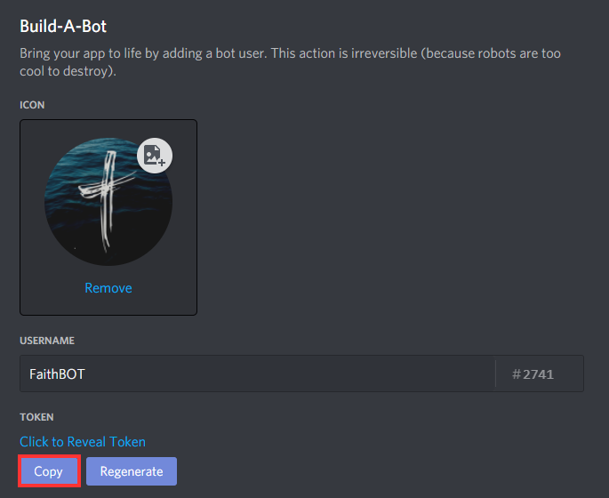
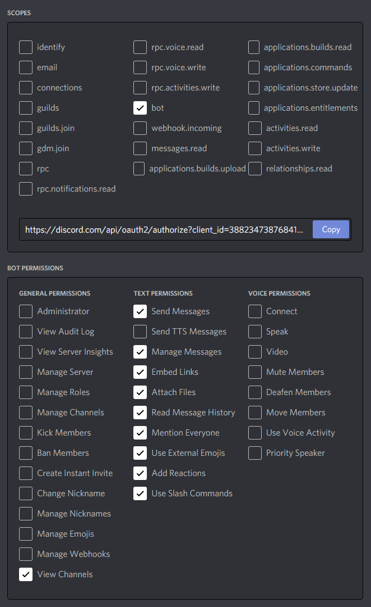

```toc

```

This article will go through the basic steps to get a Discord Bot setup and hosted through Docker. A more in depth guide on creating commands will be coming soon!

---

### Disclaimer:

The following article assumes that you some general knowledge in the following areas:

- Docker
- Node.JS
- Basic Unix Terminal Use

It also assumes that you have a local development environment setup.

---

### Setting Up

First of all, we need to install Node and Docker to our intended server host.

To install Docker, run the command relative to your distro. For our purposes, we will be installing Docker to Ubuntu.

```bash
sudo apt install docker
```

Next, we need to install Node.JS:

```bash
sudo apt install nodejs
```

We can verify that we successfully installed Docker and Node by running:

```bash
docker -v
```

```bash
node -v
```

### Creating our Project

Now it's time to create the bot! First of all, let's create ourselves a directory for our development files to live.

```bash
mkdir bot && cd bot/
```

This will create a folder called "bot" and enter into it.

Let's initialise our project using Node Package Manager:

```bash
touch index.js && npm init --yes
```

This creates a file called index.js and allows us to begin creating our bot!

We will also create a Dockerfile while we're at it. This is the file Docker will read from when creating a container.

```bash
touch Dockerfile
```

Now, let's install discord.js - the library we will use to code our bot!

```bash
npm install hydrabolt/discord.js --save
```

We'll also need a configuration token that stores our bots token.

```bash
touch .env
```

### Getting a Bot Token

In order to use the Discord Bot API, we need to create a Discord Bot account.

Navigate on over to the [Discord Application Page](https://discord.com/developers/applications).

Then select, "New Application".


Give your bot a name and select "Create".

Then, navigate to the "Bot" tab and select "Add Bot".


Be sure to grab your bots token here!


Now let's head back on over to our `.env` file and enter the following:

```
TOKEN:[YOUR-BOT-TOKEN-HERE]
```

Replace `YOUR-BOT-TOKEN-HERE` with the token you copied from your bot.

> Note: Do not push the .env file to a Git repository. Ensure this file is in your .gitignore file. Exposing this token allows other users to control your bot.

While we're at it, let's invite our Discord Bot to our server now. This will allow us to ensure the bot is working in the next step!

Navigate over to the "OAuth2" tab and select "bot" under the "scopes" section.

Now choose the permissions you want your bot to have over the servers it's connected to. Since our bot won't be doing much to begin with, let's start with the following permissions:



After selecting the appropriate permissions, click the "copy" button above the permissions. Paste the URL into your browser, choose a server to invite the bot to, and click "Authorize".

To successfully add the bot, your account needs "Manage Server" permissions.

### Create the Bot

Now that we've configured our bot's token, it's time that we actually made one!

Inside of the `index.js` file, we will create the bot. Here is an example bot I will be using for the tutorial:

```js
const Discord = require("discord.js")
const client = new Discord.Client()

client.on("ready", () => {
  console.log(`Logged in as ${client.user.tag}!`)
})

client.on("message", msg => {
  if (msg.content === "ping") {
    msg.reply("pong")
  }
})

client.login(process.env.TOKEN)
```

Now, let's run `node index.js` inside our console. We should see the bot return `ready`. Now type "ping" into your Discord server! You should receive a reply from the bot!

This means our bot is working as expected! Now it's time for us to put it inside a Docker container.

### Dockerfile

Now, we need to fill our Dockerfile with everything it needs to run a container of our application!

Since we are using the latest version of Node.JS, our first lne should be:

```bash
FROM node:latest
```

Now let's create a working directory for our bot to run inside of.

```bash
RUN mkdir -p /usr/src/bot
WORKDIR /usr/src/bot
```

Now let's tell Docker what packages it needs by copying our package.json to our working directory:

```bash
COPY package.json /usr/src/bot
RUN npm install
```

This will automatically install our Node Packages when we run our container.

We also need to copy the rest of the project across:

```bash
COPY . /usr/src/bot
```
Now, let's tell Docker how to run the bot:

```bash
CMD ["node", "index.js"]
```

Our finished file should like this:

```bash
FROM node:latest

# Create the directory!
RUN mkdir -p /usr/src/bot
WORKDIR /usr/src/bot

# Copy and Install our bot
COPY package.json /usr/src/bot
RUN npm install

# Our precious bot
COPY . /usr/src/bot

# Start me!
CMD ["node", "index.js"]
```

Now our Dockerfile is ready to be used to build a container for our bot!

### Building the Docker Image

To build the container, we first need to create a Docker Image.

```bash
docker build -t my-bot .
```

To check that our image was created successfully, run `docker images`.

### Running the Container

Now it's time to run the bot using Docker!

```bash
docker run -d my-bot
```

This grabs the Docker Image we just created and runs it using Docker!

> Note: Running our bot with `-d` allows the container to run in a detached mode also known as in the background. If you want to see each command is being run, remove that option.

To check that our Docker Container is up and running, run `docker ps`. This shows all your currently running Docker Containers.

You can view the logs of the container using `docker logs <container ID>`.

If you need to get inside the container and run a command, you can run `docker exec -it <container id> /bin/bash`.

Congratulations! You've successfully created a Discord Bot and hosted it with Docker!

### Conclusion
This is a fantastic project to get started with the basics of Docker and using containers. This same method can be used with a number of different applications.

If you have any questions or think I could have taken a better approach, let me know! Feel free to reach out in the comments below or reach out to me via [email](mailto:zacchary@puckeridge.me).